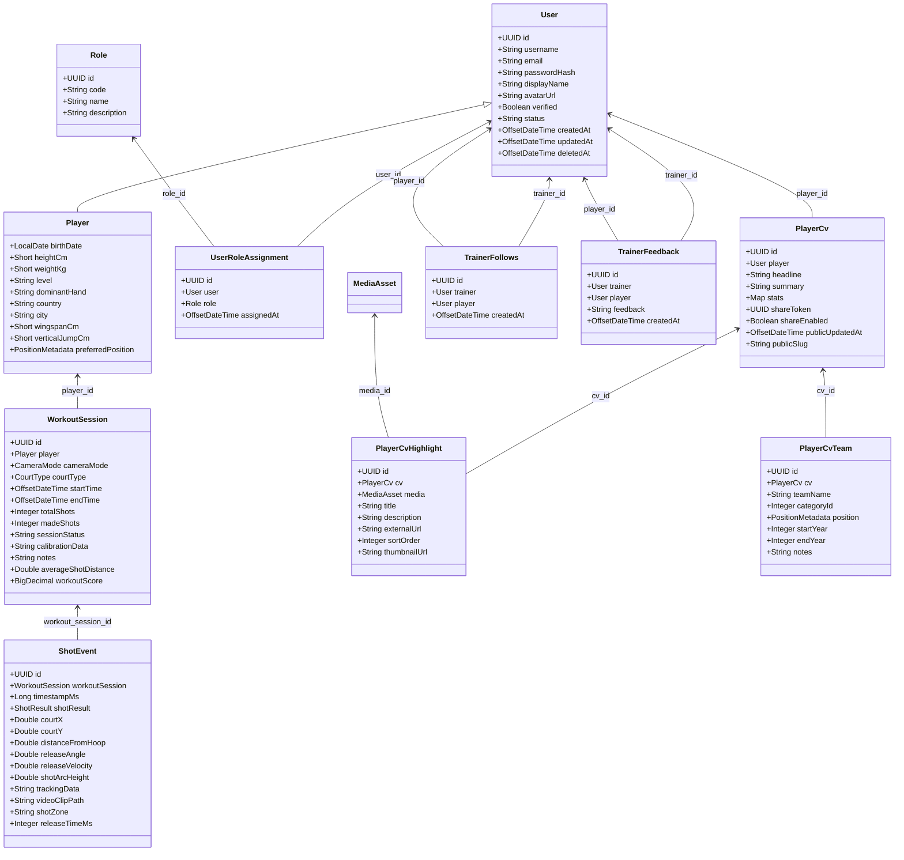

# Documento di Analisi Tecnica - Backend MVPiQ Hoops

## 1. Panoramica del Progetto

### 1.1 Informazioni Generali

- **Nome Progetto**: MVPiQ Hoops Backend
- **Framework**: Quarkus 3.8.3 (Supersonic Subatomic Java)
- **Linguaggio**: Java 17
- **Build Tool**: Maven
- **Database**: PostgreSQL (Neon Cloud)
- **Porta di Ascolto**: 8082
- **Versione**: 1.0.0-SNAPSHOT

### 1.2 Architettura Software

Il backend segue un'architettura enterprise a strati (layered architecture) per garantire la manutenibilità e la separazione dei compiti:

```
┌─────────────────────────────────────┐
│         REST API Layer              │
│  (Resource / Controller / WebSocket)│
└─────────────────────────────────────┘
                  ↓
┌─────────────────────────────────────┐
│         Service Layer               │
│  (Business Logic & AI Orchestrator) │
└─────────────────────────────────────┘
                  ↓
┌─────────────────────────────────────┐
│      Repository Layer               │
│  (Data Access - Panache/Hibernate)  │
└─────────────────────────────────────┘
                  ↓
┌─────────────────────────────────────┐
│      Database Layer                 │
│  (PostgreSQL - Neon Cloud / JSONB)  │
└─────────────────────────────────────┘
```

1. **REST API Layer**: Riceve le richieste HTTP ed espone gli endpoint e i canali WebSocket per lo scambio dati in tempo reale.
2. **Service Layer**: Contiene la logica di business dell'applicazione, coordina i servizi di intelligenza artificiale per l'elaborazione dei video e dei dati di posa, e applica le regole di dominio.
3. **Repository Layer**: Sfrutta lo schema Panache di Hibernate per semplificare l'interrogazione e la persistenza dei dati sul database PostgreSQL.
4. **Database Layer**: Rappresenta il database PostgreSQL ospitato su Neon Cloud, che gestisce sia dati relazionali strutturati che dati semi-strutturati tramite colonne JSONB.

---

## 2. Stack Tecnologico

### 2.1 Core Framework e Librerie

- **Quarkus 3.8.3**: Framework nativo Java per lo sviluppo di microservizi a basso consumo di memoria e avvio rapido.
- **Hibernate ORM con Panache**: Per la mappatura oggetto-relazionale ed esecuzione di query semplificate tramite repository pattern.
- **RESTEasy Classic**: Framework REST conforme allo standard JAX-RS per la gestione degli endpoint.
- **SmallRye OpenAPI**: Generazione automatica della documentazione OpenAPI e dell'interfaccia Swagger.
- **SmallRye JWT**: Gestione avanzata dei token JSON Web Token (JWT) per autenticazione e autorizzazione.
- **JBcrypt**: Hashing sicuro delle password degli utenti.

### 2.2 Intelligenza Artificiale e Tracking (AI / Computer Vision)

- **DJL (Deep Java Library) 0.27.0**: Motore Java per il deep learning.
- **ONNX Runtime**: Runtime per l'esecuzione di modelli ottimizzati (formato ONNX).
- **TensorFlow Engine**: Supporto aggiuntivo per modelli TensorFlow.
- **YOLOv5**: Modello customizzato per la object detection (rilevamento palla, canestro e posa del giocatore).
- **Kalman Filter**: Algoritmo predittivo per il tracciamento continuo della palla.
- **MoveNet**: Modello per il pose tracking delle articolazioni del giocatore.

### 2.3 Elaborazione Video e Manipolazione Immagini

- **FFmpeg 6.1.1**: Strumento di sistema invocato per tagliare, convertire ed elaborare i clip video dei tiri.
- **TwelveMonkeys ImageIO**: Estensione delle API ImageIO di Java per supportare formati grafici avanzati.
- **Apache Commons Math 3.6.1**: Calcoli matematici per l'analisi geometrica e la stima delle traiettorie paraboliche dei tiri.
- **Microsoft Playwright**: Generazione automatica in tempo reale di documenti PDF ad alta fedeltà con supporto per QR Code dinamici (ZXing).

### 2.4 Servizi di Terze Parti e Integrazioni

- **Firebase Admin SDK 9.2.0**: Gestione delle notifiche push tramite Firebase Cloud Messaging (FCM).
- **Supabase Client**: Integrazione per lo storage remoto e distribuito (CDN) dei video dei workout e dei frame analizzati.
- **Ollama**: Client REST per il dialogo con un modello LLM locale per la generazione di contenuti e piani di allenamento.

---

## 3. Gestione Errori Centralizzata

Il backend implementa un sistema di gestione degli errori uniforme tramite un handler globale, garantendo risposte REST standardizzate e leggibili dai client.

### 3.1 GlobalExceptionHandler

La classe `GlobalExceptionHandler` implementa `ExceptionMapper<Exception>` e intercetta tutte le eccezioni generate a livello di risorsa o di servizio:

- Cattura e mappa le eccezioni in base al tipo (es. `ResourceNotFoundException`, `IllegalArgumentException`, `IllegalStateException`).
- Restituisce risposte standardizzate in formato JSON con lo status code HTTP appropriato.
- Logga le eccezioni ad alto livello con dettagli sul path e il content-type della richiesta.

### 3.2 Struttura di ErrorResponse

Tutti gli errori vengono restituiti ai client con il seguente schema JSON predefinito:

```json
{
  "status": 404,
  "error": "Not Found",
  "message": "Resource not found",
  "path": "/api/players/123",
  "timestamp": 1717234567890
}
```

### 3.3 Mappatura delle Eccezioni

| Tipo Eccezione | Status Code | Log Level | Descrizione |
| :--- | :--- | :--- | :--- |
| `ResourceNotFoundException` | 404 Not Found | WARN | Risorsa non trovata nel DB |
| `jakarta.ws.rs.NotFoundException` | 404 Not Found | - | Endpoint non esistente |
| `IllegalStateException` | 400 Bad Request | WARN | Stato applicativo non valido per l'operazione |
| `IllegalArgumentException` | 400 Bad Request | - | Argomenti del metodo non validi |
| `jakarta.ws.rs.BadRequestException` | 400 Bad Request | - | Richiesta HTTP malformata |
| `jakarta.ws.rs.NotAuthorizedException`| 401 Unauthorized| - | Mancanza di autenticazione o token JWT scaduto |
| `jakarta.ws.rs.ForbiddenException` | 403 Forbidden | - | Ruolo dell'utente insufficiente |
| `RuntimeException` / Altre eccezioni | 500 Internal Error | ERROR | Errore imprevisto del server |

---

## 4. Modello Dati e Persistenza

Le entità Java mappano direttamente lo schema relazionale PostgreSQL. Per dati flessibili ed estensibili (es. coordinate, configurazioni e tag) viene utilizzato il tipo `jsonb` nativo di PostgreSQL, indicizzato tramite indici GIN.

### 4.1 Entità Principali



#### User
Rappresenta la tabella `users` e gestisce le informazioni base degli account utente. Supporta il soft-delete ed è la classe base per l'ereditarietà `@Inheritance(strategy = InheritanceType.JOINED)`.
- `id`: `UUID` (Primary Key)
- `username`: `String` (Unique, max 50)
- `email`: `String` (Unique, max 100)
- `passwordHash`: `String` (max 255)
- `displayName`: `String` (max 100)
- `avatarUrl`: `String` (TEXT)
- `verified`: `Boolean` (default false)
- `verifiedBy`: `UUID` (FK a users)
- `verifiedAt`: `OffsetDateTime`
- `publicProfile`: `Boolean` (default true)
- `bio`: `String` (TEXT)
- `status`: `String` (Valori: `ACTIVE`, `SUSPENDED`, `DELETED`; default `ACTIVE`)
- `createdAt`: `OffsetDateTime`
- `updatedAt`: `OffsetDateTime` (aggiornato tramite trigger DB su UPDATE)
- `deletedAt`: `OffsetDateTime` (utilizzato per soft delete)
- `userRoles`: `Set<UserRoleAssignment>` (Relazione One-to-Many)

#### Player
Estende l'entità `User` (tabella `players`, legata tramite `@PrimaryKeyJoinColumn(name = "id")`). Rappresenta il profilo atletico e fisico del giocatore.
- `birthDate`: `LocalDate`
- `heightCm`: `Short` (Validato 50-300 cm)
- `weightKg`: `Short` (Validato 20-300 kg)
- `level`: `String` (max 50)
- `dominantHand`: `String` (max 10)
- `country`: `String` (max 50)
- `city`: `String` (max 50)
- `approximateAge`: `Integer` (Validato 1-100 anni)
- `gender`: `String` (max 10)
- `wingspanCm`: `Short`
- `verticalJumpCm`: `Short`
- `preferredPosition`: `PositionMetadata` (Many-to-One, preferred_position_id)
- `positions`: `List<PlayerPosition>` (Relazione One-to-Many)

#### PlayerPosition
Mappa la tabella `player_positions`, associando i ruoli secondari o principali che un giocatore può ricoprire in campo.
- `id`: `UUID` (PK)
- `player`: `Player` (Many-to-One, player_id)
- `position`: `PositionMetadata` (Many-to-One, position_id)
- `isPrimary`: `Boolean`

#### PositionMetadata
Tabella `position_metadata`. Contiene le informazioni di catalogo sui ruoli di pallacanestro (Playmaker, Guardia, Ala Piccola, Ala Grande, Centro).
- `id`: `UUID` (PK)
- `code`: `String` (Unique, max 10)
- `name`: `String` (max 50)
- `description`: `String` (TEXT)

#### WorkoutSession
Tabella `workout_sessions`. Sessione di allenamento/rilevamento tiri avviata da un giocatore tramite dispositivo mobile.
- `id`: `UUID` (PK)
- `player`: `Player` (Many-to-One, player_id)
- `cameraMode`: `CameraMode` (Enum: `LATERAL`, `FRONTAL`, `ANGLE_45`)
- `courtType`: `CourtType` (Enum: `HALF_COURT`, `FULL_COURT`)
- `startTime`: `OffsetDateTime`
- `endTime`: `OffsetDateTime`
- `totalShots`: `Integer` (default 0)
- `madeShots`: `Integer` (default 0)
- `sessionStatus`: `String` (Valori: `ACTIVE`, `COMPLETED`, `PAUSED`)
- `calibrationData`: `String` (JSON contenente i parametri di calibrazione e matrice di omografia)
- `notes`: `String` (TEXT, note riassuntive dell'allenamento)
- `averageShotDistance`: `Double` (distanza media espressa in metri)
- `workoutScore`: `BigDecimal` (valutazione complessiva del workout)
- `createdAt`: `OffsetDateTime`
- `updatedAt`: `OffsetDateTime`

#### ShotEvent
Tabella `shot_events`. Ogni singolo tiro registrato all'interno di una sessione di workout.
- `id`: `UUID` (PK)
- `workoutSession`: `WorkoutSession` (Many-to-One, workout_session_id)
- `timestampMs`: `Long` (timestamp del tiro all'interno del flusso)
- `shotResult`: `ShotResult` (Enum: `MADE`, `MISS`, `BLOCKED`, `AIRBALL`)
- `courtX`: `Double` (coordinata X reale sul campo)
- `courtY`: `Double` (coordinata Y reale sul campo)
- `distanceFromHoop`: `Double` (distanza dal ferro in metri)
- `releaseAngle`: `Double` (angolo di rilascio in gradi)
- `releaseVelocity`: `Double` (velocità di rilascio in m/s)
- `shotArcHeight`: `Double` (altezza massima dell'arco in metri)
- `videoTimestampMs`: `Long` (tempo corrispondente all'interno del file video)
- `detectionConfidence`: `Double` (affidabilità del tracciamento AI)
- `trackingData`: `String` (JSONB, serie di coordinate X/Y del volo della palla per ricostruzione traiettoria)
- `videoClipPath`: `String` (percorso dello storage cloud del clip video del tiro)
- `shotZone`: `String` (Zona di tiro calcolata: `PAINT`, `MID_RANGE`, `THREE_POINT`, `CORNER`)
- `releaseTimeMs`: `Integer` (tempo complessivo impiegato per il rilascio della palla)
- `createdAt`: `OffsetDateTime`

#### CourtCalibration
Tabella `court_calibrations`. Dati geometrici di mappatura del campo di gioco per le sessioni di workout.
- `id`: `UUID` (PK)
- `workoutSession`: `WorkoutSession` (Many-to-One, workout_session_id)
- `hoopCenterX`/`Y`: `Double` (centro del canestro in pixel)
- `freeThrowLineX`/`Y`: `Double` (linea tiro libero)
- `threePointLineTopX`/`Y`: `Double` (arco da 3 punti centrale)
- `threePointLineLeftX`/`Y`: `Double`
- `threePointLineRightX`/`Y`: `Double`
- `baselineX`/`Y`: `Double`
- `sidelineLeftX`/`Y`: `Double`
- `sidelineRightX`/`Y`: `Double`
- `homographyMatrix`: `String` (JSONB della matrice 3x3 usata per la proiezione prospettica)
- `calibrationConfidence`: `Double`
- `createdAt`: `OffsetDateTime`
- `updatedAt`: `OffsetDateTime`

#### WorkoutFrameData
Tabella `workout_frame_data`. Dati grezzi estratti frame-by-frame durante la sessione video per l'elaborazione dell'algoritmo AI.
- `id`: `UUID` (PK)
- `session`: `WorkoutSession` (Many-to-One, session_id)
- `frameTimestamp`: `Long` (ms relativi)
- `ballX`/`Y`: `Double` (coordinate palla in pixel)
- `ballConfidence`: `Double`
- `hoopX`/`Y`: `Double` (coordinate canestro in pixel)
- `hoopConfidence`: `Double`
- `poseData`: `Map<String, Object>` (JSONB, coordinate delle articolazioni rilevate tramite MoveNet)
- `trajectoryData`: `Map<String, Object>` (JSONB, storico vettoriale traiettoria)
- `ballVelocityX`/`Y`: `Double` (velocità istantanea palla in px/frame)
- `shotDetected`: `Boolean`
- `createdAt`: `OffsetDateTime`

#### JournalEntry
Tabella `journal_entries`. Diario sportivo compilato dal giocatore per monitorare performance e benessere fisico.
- `id`: `UUID` (PK)
- `player`: `Player` (Many-to-One, player_id)
- `entryType`: `String` (Valori: `MATCH`, `TRAINING`)
- `title`: `String` (max 200)
- `description`: `String` (TEXT)
- `entryDate`: `OffsetDateTime`
- `opponent`: `String` (max 200)
- `location`: `String` (max 200)
- `durationMinutes`: `Integer` (Validato >= 0)
- `moodRating`: `Short` (Valori validi: 1-5)
- `performanceRating`: `Short` (Valori validi: 1-5)
- `visibility`: `String` (Enum: `PRIVATE`, `TRAINER`, `PUBLIC`)
- `checklistCompleted`: `Boolean` (default false)
- `tags`: `String` (JSONB, tag liberi inseriti dall'utente)
- `deletedAt`: `OffsetDateTime`
- `createdAt`: `OffsetDateTime`
- `updatedAt`: `OffsetDateTime`

#### ChecklistTemplate, ChecklistTemplateItem, ChecklistTemplateItemOption
Strutture per definire schede di valutazione personalizzate o checklist da compilare all'interno del diario.
- `ChecklistTemplateItem` include:
  - `placeholder`: `String` (placeholder per l'input)
  - `helpText`: `String` (testo informativo di supporto)
  - `validationRules`: `String` (JSONB, regole sintattiche di validazione come min/max o pattern regex)
  - `dataType`: `String` (Tipo dato: `BOOLEAN`, `NUMBER`, `TEXT`, `DATE`, `SELECT`, `MULTI_SELECT`)
  - `selectSource`: `String` (Sorgente opzioni: `STATIC`, `POSITION_METADATA`, `PLAYER_POSITION`, `TRAINING_TYPE`, `SQL`)

#### AthleteGoal
Tabella `athlete_goals`. Obiettivi sportivi fissati dall'atleta (es. tiri realizzati o salti verticali).
- `id`: `UUID` (PK)
- `player`: `User` (Many-to-One, player_id)
- `title`: `String` (max 200)
- `description`: `String` (TEXT)
- `targetValue`: `BigDecimal`
- `currentValue`: `BigDecimal` (default 0)
- `unit`: `String` (max 50, es: "cm", "%", "made")
- `dueDate`: `LocalDate`
- `completedAt`: `OffsetDateTime`
- `status`: `String` (Valori: `ACTIVE`, `COMPLETED`, `ABANDONED`)
- `priority`: `String` (Valori: `LOW`, `MEDIUM`, `HIGH`; default `MEDIUM`)
- `progressPercentage`: `BigDecimal` (Valori: 0.00-100.00; default 0)
- `createdAt`: `OffsetDateTime`

#### TrainingProgram
Tabella `training_programs`. Programmi di allenamento strutturati o generati via AI.
- `id`: `UUID` (PK)
- `owner`: `User` (Many-to-One, owner_id)
- `title`: `String` (max 200)
- `description`: `String` (TEXT)
- `programJson`: `Object` (JSONB, sequenza strutturata degli esercizi)
- `isPublic`: `Boolean` (default true)
- `estimatedDurationMinutes`: `Integer`
- `difficulty`: `String` (Enum: `BEGINNER`, `INTERMEDIATE`, `ADVANCED`)
- `tags`: `Object` (JSONB per tassonomia e tag del programma)
- `publishedAt`: `OffsetDateTime`
- `sourceType`: `SourceType` (Enum: `MANUAL`, `AI_GENERATED`)
- `goal`: `AthleteGoal` (Many-to-One, goal_id)
- `generatedByAi`: `Boolean` (default false)
- `aiModel`: `String`
- `aiPrompt`: `String` (TEXT)
- `aiGenerationParameters`: `Object` (JSONB)
- `generationStatus`: `GenerationStatus` (Enum: `PENDING`, `PROCESSING`, `COMPLETED`, `FAILED`)
- `generatedAt`: `OffsetDateTime`
- `parentProgram`: `TrainingProgram` (Many-to-One, parent_program_id)
- `createdAt`: `OffsetDateTime`
- `updatedAt`: `OffsetDateTime`

#### TrainingSession
Tabella `training_sessions`. Esecuzione effettiva di un programma di allenamento da parte di un giocatore.
- `id`: `UUID` (PK)
- `player`: `User` (Many-to-One, player_id)
- `program`: `TrainingProgram` (Many-to-One, program_id)
- `sessionDate`: `OffsetDateTime`
- `sessionData`: `Object` (JSONB, risultati per singolo esercizio svolto)
- `durationSeconds`: `Integer`
- `caloriesBurned`: `Integer`
- `averageHeartRate`: `Integer`
- `perceivedEffort`: `Short` (Scala sforzo percepito 1-10)
- `createdAt`: `OffsetDateTime`

#### Badge & AthleteBadge
Tabelle `badges` e `athlete_badges` per la gamification.
- I badge contengono:
  - `rarity`: `String` (Valori: `COMMON`, `RARE`, `EPIC`, `LEGENDARY`; default `COMMON`)
  - `active`: `Boolean` (default true)
  - `createdAt`/`updatedAt`: `OffsetDateTime`

#### MediaAsset
Tabella `media_assets`. File multimediali caricati o referenziati nel sistema.
- `id`: `UUID` (PK)
- `ownerId`: `UUID`
- `title`/`description`: `String`
- `mediaType`: `String` (es. `VIDEO`, `IMAGE`, `AUDIO`)
- `storageUrl`: `String`
- `thumbnailUrl`: `String`
- `durationSeconds`: `Integer`
- `width`/`height`: `Integer`
- `isOfficial`: `Boolean`
- `mimeType`: `String` (max 100, es: `video/mp4`)
- `fileSizeBytes`: `Long`
- `visibility`: `String` (Valori: `PRIVATE`, `PUBLIC`, `UNLISTED`; default `PRIVATE`)
- `storageProvider`: `String` (es: `SUPABASE`, default `SUPABASE`)
- `storageBucket`/`storagePath`: `String`
- `externalUrl`: `String` (URL esterno es. YouTube, Vimeo, Hudl)
- `createdAt`: `OffsetDateTime`

#### Exercise
Tabella `exercises`. Catalogo degli esercizi disponibili.
- `id`: `UUID` (PK)
- `name`: `String`
- `description`: `String` (TEXT)
- `equipment`: `Object` (JSONB, lista delle attrezzature necessarie)
- `tags`: `Object` (JSONB)
- `caloriesEstimate`: `Integer` (stima calorie per minuto)

#### Message & Conversation
Tabelle `messages` e `conversations` per la messaggistica interna.
- `Message` supporta:
  - `replyToMessage`: `Message` (FK self-reference, supporta risposte dirette e thread)
  - `editedAt`: `OffsetDateTime`
  - `deletedAt`: `OffsetDateTime` (soft-delete del messaggio)
  - `conversation`: `Conversation` (Many-to-One, conversation_id)
  - `sender`: `User` (Many-to-One, sender_id)

#### Notification
Tabella `notifications`. Notifiche push inviate ai dispositivi degli utenti.
- `id`: `UUID` (PK)
- `user`: `User` (Many-to-One, user_id)
- `title`/`content`: `String`
- `isRead`: `Boolean` (default false, tracciato per notifiche non lette)
- `createdAt`: `OffsetDateTime` (con fuso orario `timestamptz`)

#### VideoAnalysisSession
Tabella `video_analysis_sessions`. Elaborazioni video asincrone o sincrone.
- `id`: `UUID` (PK)
- `player`: `Player` (Many-to-One, player_id)
- `videoAsset`: `MediaAsset` (Many-to-One, video_asset_id)
- `status`: `String` (Valori: `UPLOADED`, `PROCESSING`, `COMPLETED`, `FAILED`)
- `errorMessage`: `String` (TEXT, dettagli in caso di fallimento)
- `retryCount`: `Integer` (default 0, contatore tentativi)
- `createdAt`/`updatedAt`: `OffsetDateTime`

#### TrainerFollows
Tabella `trainer_follows`. Relazione molti-a-molti che traccia quali allenatori seguono quali giocatori.
- `id`: `UUID` (PK)
- `trainer`: `User` (Many-to-One, trainer_id - referenzia la tabella users)
- `player`: `User` (Many-to-One, player_id - referenzia la tabella users)
- `createdAt`: `OffsetDateTime`

#### TrainerFeedback
Tabella `trainer_feedbacks`. Memorizza lo storico dei feedback e delle valutazioni inserite dagli allenatori per gli atleti seguiti.
- `id`: `UUID` (PK)
- `trainer`: `User` (Many-to-One, trainer_id)
- `player`: `User` (Many-to-One, player_id)
- `feedback`: `String` (TEXT, contenuto del feedback)
- `createdAt`: `OffsetDateTime`

#### PlayerCv
Tabella `player_cv`. Il CV sportivo digitale di un giocatore.
- `id`: `UUID` (PK)
- `player`: `User` (One-to-One, player_id - referenza users)
- `headline`: `String` (slogan del giocatore, es: "Guardia tiratrice ad alta precisione")
- `summary`: `String` (TEXT, riassunto delle caratteristiche e ambizioni)
- `stats`: `Map<String, Object>` (JSONB, statistiche salienti manuali o calcolate)
- `shareToken`: `UUID` (Unique, token casuale non predicibile per l'accesso pubblico)
- `shareEnabled`: `Boolean` (default false, interruttore per abilitare/disabilitare la visibilità pubblica del link)
- `publicUpdatedAt`: `OffsetDateTime` (timestamp dell'ultima pubblicazione)
- `publicSlug`: `String` (max 100, slug leggibile per SEO)
- `createdAt`/`updatedAt`: `OffsetDateTime`

#### PlayerCvHighlight
Tabella `player_cv_highlights`. Clip video dei migliori tiri o azioni del giocatore associati al CV.
- `id`: `UUID` (PK)
- `cv`: `PlayerCv` (Many-to-One, cv_id)
- `media`: `MediaAsset` (Many-to-One, media_id, può essere nullo se si usa un link esterno)
- `title`: `String` (max 150)
- `description`: `String` (TEXT)
- `externalUrl`: `String` (TEXT, URL di YouTube/Vimeo/Hudl se non caricato su Supabase)
- `sortOrder`: `Integer` (default 0, per ordinamento manuale delle clip)
- `thumbnailUrl`: `String` (TEXT, anteprima del video)

#### PlayerCvTeam
Tabella `player_cv_teams`. Storico delle squadre e delle stagioni passate/presenti del giocatore nel CV.
- `id`: `UUID` (PK)
- `cv`: `PlayerCv` (Many-to-One, cv_id)
- `teamName`: `String` (nome della squadra, obbligatorio)
- `categoryId`: `Integer` (id della categoria)
- `position`: `PositionMetadata` (Many-to-One, position_id, ruolo ricoperto in quella squadra)
- `startYear`: `Integer` (anno inizio militanza)
- `endYear`: `Integer` (anno fine militanza, nullo se ancora attivo)
- `notes`: `String` (TEXT, commenti o traguardi raggiunti con la squadra)

---

## 5. Sicurezza e Controllo Accessi (RBAC)

La sicurezza del backend è basata su **JSON Web Token (JWT)** gestiti tramite la specifica MicroProfile JWT (SmallRye JWT) con crittografia asimmetrica RSA (chiavi pubblica e privata PEM).

### 5.1 Ruoli Applicativi (RBAC)

Il sistema supporta la multi-ruolo-assegnazione (un utente può possedere più ruoli simultaneamente). I ruoli sono salvati sul DB (`roles`, `user_roles`) ed esposti all'interno del token JWT sotto il claim `role` (configurato con `smallrye.jwt.path.groups=role`).

I ruoli standard disponibili sono:
- **`ADMIN`**: Amministratore totale del sistema.
- **`TRAINER`**: Allenatore. Può seguire i giocatori, consultare i loro progressi, e inserire feedback.
- **`PLAYER`**: Giocatore di basket. Può registrare workout, compilare il diario ed il proprio CV.
- **`SCOUT`**: Talent scout. Può cercare giocatori tramite filtri complessi ed esaminarne i CV pubblici.
- **`CREATOR`**: Creatore di contenuti o programmi di allenamento ufficiali.
- **`GUEST`**: Profilo ospite con permessi limitati di sola lettura.

### 5.2 Annotazioni di Sicurezza ed Helper

Nei controller REST l'autorizzazione viene applicata in modo dichiarativo:
- `@RolesAllowed({"PLAYER", "TRAINER"})`: Restringe l'endpoint solo agli utenti aventi almeno uno dei ruoli indicati.
- `@Authenticated`: Richiede un token valido senza vincoli di ruolo specifico.
- `@PermitAll`: Rende l'endpoint pubblico (es: visualizzazione del CV pubblico).

All'interno dei servizi, la logica di controllo dei ruoli si appoggia a metodi dedicati del servizio di sicurezza (`RoleBasedSecurityService`):
- `hasRole(UserRole)`: Verifica se l'utente autenticato possiede il ruolo.
- `hasAnyRole(UserRole...)`: Verifica se l'utente possiede almeno uno dei ruoli della lista.
- `canTrain()`: Ritorna vero se l'utente ha ruolo `TRAINER` o `ADMIN`.
- `canScout()`: Ritorna vero se l'utente ha ruolo `SCOUT`, `TRAINER` o `ADMIN`.
- `canCreateContent()`: Ritorna vero se l'utente ha ruolo `CREATOR` o `ADMIN`.

---

## 6. Catalogo API REST e WebSocket

Tutti gli endpoint rispondono sotto il path base dell'applicazione. Di seguito sono elencate le API suddivise per macro-moduli.

### 6.1 Autenticazione (`/api/auth`)

- **`POST /api/auth/register`**: Registra un nuovo utente.
- **`POST /api/auth/login`**: Effettua il login e ritorna il token JWT.
- **`POST /api/auth/logout`**: Disconnette l'utente invalidando la sessione lato client.

### 6.2 Profili Giocatori & CV Sportivo (`/api/players`, `/public/cv`)

#### Profilo e CV Privato (Autenticato)
- **`GET /api/players`**: Recupera ed elenca i profili dei giocatori con supporto a filtri (paese, livello, ruolo, età).
- **`GET /api/players/{playerId}/cv`**: Recupera il CV sportivo completo del giocatore. Se il CV non esiste, viene creato automaticamente vuoto per ottimizzare la UX del client.
- **`GET /api/players/{playerId}/cv/pdf`**: Esporta il CV del giocatore in formato PDF (generato lato server via Playwright con QR Code integrato).
- **`PUT /api/players/{playerId}/cv`**: Aggiorna le informazioni del CV (headline, summary, statistiche salienti, cronologia delle squadre).
- **`GET /api/players/{playerId}/cv/highlights`**: Recupera la lista dei clip video inseriti come highlights.
- **`POST /api/players/{playerId}/cv/highlights`**: Aggiunge un highlight al CV. Supporta sia video caricati internamente (passando `mediaId`) sia link esterni (YouTube, Vimeo, Hudl).
  - *Request Body*: `{"title": "Triple", "description": "...", "externalUrl": "...", "mediaId": "..."}`
- **`DELETE /api/players/{playerId}/cv/highlights/{highlightId}`**: Rimuove un highlight specifico.

#### Condivisione e Link Pubblico
- **`POST /api/players/{playerId}/cv/share`**: Abilita la condivisione pubblica del CV, generando il token UUID univoco non predicibile.
  - *Response*: `{"shareToken": "uuid-v4", "shareEnabled": true, "publicUrl": "http://domain.com/public/cv/uuid-v4/view"}`
- **`DELETE /api/players/{playerId}/cv/share`**: Disabilita e revoca immediatamente la condivisione del CV, invalidando il link.
- **`GET /public/cv/{token}`**: *[@PermitAll]* Recupera il CV in formato JSON. Consente l'integrazione con altre applicazioni o app mobili.
- **`GET /public/cv/{token}/view`**: *[@PermitAll]* Restituisce la pagina web HTML autogenerata dal backend per la visualizzazione diretta nel browser. Offre un design scuro e responsive ottimizzato per smartphone e desktop (stile LinkedIn/Hudl card), include caching di 5 minuti (`Cache-Control: public, max-age=300`) e protezione anti-framing (`X-Frame-Options: SAMEORIGIN`).
- **`GET /public/cv/{token}/pdf`**: *[@PermitAll]* Scarica direttamente la versione PDF pubblica del CV condiviso.

### 6.3 Workout e Tracking Tiri (`/api/workouts`)

- **`POST /api/workouts/sessions`**: Inizia una sessione di workout.
  - *Request*: `{"cameraMode": "ANGLE_45", "courtType": "HALF_COURT", "calibrationData": "..."}`
- **`GET /api/workouts/sessions/{sessionId}`**: Recupera i dettagli di una sessione specifica.
- **`GET /api/workouts/sessions`**: Recupera l'elenco storico di tutte le sessioni del giocatore.
- **`GET /api/workouts/sessions/active`**: Ritorna l'eventuale sessione ancora attiva per il giocatore.
- **`POST /api/workouts/sessions/{sessionId}/pause`**: Mette in pausa il tracking della sessione.
- **`POST /api/workouts/sessions/{sessionId}/resume`**: Riprende una sessione in pausa.
- **`POST /api/workouts/sessions/{sessionId}/end`**: Chiude definitivamente la sessione ed esegue il calcolo finale della durata e dei punteggi.
- **`DELETE /api/workouts/sessions/{sessionId}`**: Elimina una sessione e i relativi dati associati.
- **`POST /api/workouts/sessions/{sessionId}/frames`**: Salva le coordinate e i dati del frame video per l'analisi in tempo reale della traiettoria.
- **`POST /api/workouts/sessions/{sessionId}/pose-analysis`**: Registra i dati delle posizioni delle articolazioni del giocatore (pose landmarks).
- **`GET /api/workouts/sessions/{sessionId}/realtime-stats`**: Ritorna le statistiche correnti calcolate sul momento (tiri totali, realizzati, streak, heat zones).

#### Aggiornamenti Live via WebSocket
- **`WS /api/workouts/live/{sessionId}?userId={userId}`**: Connessione WebSocket per lo streaming bidirezionale in tempo reale.
  - Trasmette automaticamente ogni secondo le statistiche aggiornate.
  - Esegue un push immediato a tutti i client registrati per la sessione non appena viene inserito o rilevato un nuovo tiro.

### 6.4 Eventi Tiro e Calibrazione (`/api/workouts`)

- **`GET /api/workouts/sessions/{sessionId}/shots`**: Ritorna tutti i tiri eseguiti nella sessione.
- **`POST /api/workouts/sessions/{sessionId}/shots`**: Aggiunge manualmente o via AI un evento tiro alla sessione.
  - *Request*: `{"timestampMs": 123456, "shotResult": "MADE", "courtX": 4.5, "courtY": 6.2, "distanceFromHoop": 6.75, "releaseAngle": 48.0, "releaseVelocity": 12.1, "detectionConfidence": 0.94}`
- **`POST /api/workouts/sessions/{sessionId}/calibration`**: Salva le coordinate pixel del canestro e delle linee rilevate sul campo per impostare l'omografia.

### 6.5 Analytics e Statistiche (`/api/workouts`)

- **`GET /api/workouts/{sessionId}/analytics/shot-chart`**: Ritorna la mappa di tiro (shot chart) con le coordinate X/Y e i conteggi raggruppati per zone.
- **`GET /api/workouts/{sessionId}/analytics/stats`**: Statistiche dettagliate della sessione.
- **`GET /api/workouts/{sessionId}/analytics/zones`**: Percentuali di tiro suddivise per aree regolamentari (PAINT, MID_RANGE, THREE_POINT, CORNER).
- **`GET /api/workouts/{sessionId}/analytics/hot-zones`**: Ritorna le zone con le migliori percentuali di realizzazione.
- **`GET /api/workouts/{sessionId}/analytics/cold-zones`**: Ritorna le zone con performance critiche o al di sotto della media dell'atleta.
- **`GET /api/workouts/{sessionId}/analytics/career-stats`**: Ritorna il riassunto complessivo di tutta la carriera del giocatore.

### 6.6 Trainer e Relazioni Coach-Atleta (`/api/trainer`)

- **`POST /api/trainer/follow`**: Consente ad un allenatore autenticato di seguire un giocatore. Verifica i ruoli dell'utente via RBAC e impedisce relazioni duplicate.
  - *Request*: `{"trainerId": "uuid", "playerId": "uuid"}`
- **`DELETE /api/trainer/follow`**: Rimuove la relazione di follow tra allenatore e giocatore.
- **`GET /api/trainer/follows/{trainerId}`**: Ritorna tutti i profili degli atleti seguiti da quell'allenatore.
- **`GET /api/trainer/followers/{playerId}`**: Ritorna tutti gli allenatori che seguono il giocatore.
- **`GET /api/trainer/follow/check`**: Verifica se un allenatore segue un giocatore specifico. Ritorna `{"isFollowing": true/false}`.
- **`GET /api/trainer/stats/{trainerId}`**: Statistiche dell'allenatore (es. numero di atleti seguiti).
- **`GET /api/trainer/players/{trainerId}/progress`**: Ritorna la dashboard di avanzamento in tempo reale per tutti i giocatori seguiti (sessioni svolte, punti, streak, minuti settimanali, goal attivi/completati).
- **`GET /api/trainer/players/{playerId}/details`**: Ritorna le informazioni dettagliate e riservate dell'atleta (dati fisici, posizioni preferite, obiettivi attivi, storico dei feedback dell'allenatore e le ultime sessioni completate) previa verifica dell'associazione di follow.
- **`POST /api/trainer/feedback`**: Consente all'allenatore di inserire e persistere sul DB un nuovo feedback/nota tecnica per il giocatore seguito.
  - *Request*: `{"trainerId": "uuid", "playerId": "uuid", "feedback": "Ottimo lavoro sul tiro da tre"}`
- **`GET /api/trainer/follow-count/{trainerId}`**: Numero di giocatori seguiti.
- **`GET /api/trainer/follower-count/{playerId}`**: Numero di allenatori che seguono il giocatore.

### 6.7 Diario, Training e Gamification

- **`/api/journal`**: Gestione CRUD delle Journal Entries dell'atleta, comprese le checklist associate.
- **`/api/training/programs`**: Gestione dei programmi di allenamento sia manuali che autogenerati via AI (Ollama).
- **`/api/gamification`**: Tracciamento dei punti accumulati, progressi degli obiettivi, classifiche generali e assegnazione Badge di gioco.

---

## 7. Pipeline Computer Vision e AI

La pipeline di tracciamento e analisi si attiva durante l'elaborazione dei video registrati per scomporre l'azione del tiro in coordinate geometriche e metriche fisiche.

```
[Frame Video] ──> (YOLOv5 Object Detection) ──> [Palla, Canestro, Giocatore]
                                                       │
                                                       ▼
                                            (Kalman Filter Tracking)
                                                       │
                                                       ▼
                                           (Shot Detection Algorithm)
                                                       │
                                                       ▼
                                            [Rilascio Palla / Parabola]
                                                       │
                                                       ▼
                                            (Made/Miss Determination)
                                                       │
                                                       ▼
                                             (Homography Projection)
```

### 7.1 Object Detection (YOLOv5)
- **Input**: Flusso di frame a 30 o 60 fps.
- **Modello YOLOv5**: Esegue l'inferenza (inferiore a 30ms per frame) per estrarre le coordinate delle bounding box relative a:
  - Palla da basket.
  - Canestro (ferro e tabellone).
  - Giocatore.

### 7.2 Kalman Filter (Tracking)
- Gestisce il tracciamento vettoriale continuo della palla.
- Corregge le coordinate rilevate e stima la posizione della palla nei frame in cui si verificano occlusioni temporanee (es. palla coperta dal corpo del giocatore) o problemi di motion blur.

### 7.3 Algoritmo di Rilevamento Tiro
Il sistema riconosce l'inizio di un'azione di tiro analizzando le coordinate relative e i vettori di velocità:
1. **Fase di Caricamento**: La palla è rilevata in prossimità delle mani del giocatore (tramite i landmark delle articolazioni estratti da MoveNet).
2. **Rilascio**: Viene calcolato un vettore di velocità verso l'alto superiore a una soglia minima impostata (`> 2.0 px/s`).
3. **Separazione**: La palla si allontana dalle bounding box del giocatore mantenendo una traiettoria ascendente.
4. **Fase di Volo**: Calcolo dell'equazione parabolica per determinare l'apice della traiettoria (altezza massima dell'arco) e l'angolo di rilascio.

### 7.4 Determinazione del Risultato (Made/Miss)
- **MADE (Canestro realizzato)**: La palla entra nell'area cilindrica del ferro dall'alto verso il basso senza rimbalzare oltre il diametro esterno e scende al di sotto della quota del canestro con una traiettoria lineare.
- **MISS (Errore)**: La traiettoria della palla interseca il tabellone o il ferro rimbalzando all'esterno, oppure manca completamente il cilindro (Airball/Blocked).

### 7.5 Proiezione sul Campo Reale (Omografia Prospettica)
- Utilizza i punti catturati nella fase di calibrazione iniziale (canestro, tiro libero, arco da tre punti, linee perimetrali) per calcolare una matrice di omografia prospettica 3x3.
- Converte le coordinate bidimensionali del pixel video `(X_pixel, Y_pixel)` nelle coordinate cartesiane metriche reali del campo da basket `(X_court_meters, Y_court_meters)`. Questo passaggio posiziona accuratamente i tiri sullo shot chart.

---

## 8. Configurazione dell'Applicazione

Il backend viene configurato tramite il file `application.properties` (o variabili d'ambiente equivalenti in fase di runtime).

### 8.1 Parametri Principali

```properties
# Server HTTP
quarkus.http.host=0.0.0.0
quarkus.http.port=8082

# Connessione al Database (Neon Cloud - PostgreSQL)
quarkus.datasource.db-kind=postgresql
quarkus.datasource.username=neondb_owner
quarkus.datasource.password=xxxxxxxxxxxx
quarkus.datasource.jdbc.url=jdbc:postgresql://ep-blue-hat-abs1hipi-pooler.eu-west-2.aws.neon.tech/neondb?sslmode=require
quarkus.hibernate-orm.packages=com.mvpiq.model
quarkus.hibernate-orm.schema-management.strategy=validate

# Connection Pool
quarkus.datasource.jdbc.min-size=5
quarkus.datasource.jdbc.max-size=20

# Configurazione Sicurezza JWT
mp.jwt.verify.issuer=mvpiq-hoops
mp.jwt.verify.publickey.location=publicKey.pem
smallrye.jwt.sign.key.location=privateKey.pem
smallrye.jwt.path.groups=role

# Supabase Storage Integration
supabase.url=https://gnjwgcronnnzxokmuqlw.supabase.co
supabase.bucket.videos=videos
supabase.bucket.frames=analysis-frames
supabase.bucket.profile-images=profile-images

# Risoluzione Video di Riferimento per tracking
mvpiq.video.frame-width=960
mvpiq.video.frame-height=544
mvpiq.hoop.fallback-radius=18
mvpiq.hoop.search-frames=10

# Integrazione LLM (Ollama)
quarkus.rest-client.ollama-api.url=http://localhost:11434
quarkus.rest-client.ollama-api.connect-timeout=10000
quarkus.rest-client.ollama-api.read-timeout=300000

# Integrazione Firebase (Notifiche Push)
firebase.config.path=firebase-service-account.json
firebase.project.id=mvpiq-hoops
firebase.database.url=https://mvpiq-hoops-default-rtdb.firebaseio.com
```

---

## 9. Deployment e Gestione Operativa

### 9.1 Comandi di Build Maven

- **Compilazione standard ed esecuzione test**:
  ```bash
  ./mvnw clean package
  ```
- **Avvio in modalità Dev (Live Coding)**:
  ```bash
  ./mvnw compile quarkus:dev
  ```
- **Compilazione in immagine nativa (GraalVM / Mandrel)**:
  ```bash
  ./mvnw package -Pnative
  ```

### 9.2 Dockerfile per Immagini Native

L'applicazione può essere pacchettizzata all'interno di un container Linux ultraleggero ottimizzato per immagini native:

```dockerfile
FROM quay.io/quarkus/quarkus-mandrel:22.3-java17
COPY target/*-runner /application
EXPOSE 8082
CMD ["/application/run-application.sh"]
```

### 9.3 Monitoraggio e Logging

- **Logging**: Basato su `java.util.logging`. I log sono strutturati per tracciare le richieste in ingresso, i fallimenti delle pipeline AI e le transazioni del DB.
- **Health Check**: Endpoint di base esposto a `GET /mvpiq` per verificare la raggiungibilità del microservizio da parte dei load balancer o orchestratori.

---

## 10. Criticità e Strategie di Mitigazione

1. **Motion Blur della Palla**:
   - *Problema*: La palla si muove ad alta velocità e risulta sfocata nel frame video singolo, compromettendo il rilevamento YOLO.
   - *Mitigazione*: Utilizzo di riprese ad alti frame rate (60 fps) combinato con il tracciamento del Filtro di Kalman, che stima la posizione basandosi sull'inerzia fisica dei frame precedenti.
2. **Illuminazione Variabile delle Palestre**:
   - *Problema*: Le ombre marcate o i riflessi di luce artificiale confondono i modelli di object detection.
   - *Mitigazione*: Operazione di pre-processing dell'immagine per normalizzare il contrasto e la luminosità prima dell'inferenza, unita ad una forte fase di data-augmentation durante il training del modello YOLO.
3. **Occlusioni Fisiche**:
   - *Problema*: Il corpo dell'atleta o un difensore nascondono temporaneamente la palla o il ferro.
   - *Mitigazione*: Interpolazione della traiettoria parabolica. Se la palla scompare per meno di 5 frame consecutivi, la sua posizione viene ricostruita geometricamente interpolando i punti visibili di ascesa e discesa.

---

## 11. Estensioni Future

1. **Tracciamento Multiplayer**: Estensione della pipeline YOLO per rilevare e tracciare più giocatori contemporaneamente sul campo di gioco, consentendo l'analisi di allenamenti di squadra.
2. **Dashboard Avanzata per Coach**: Interfaccia web dedicata per consentire agli allenatori di confrontare le metriche di tiro (angoli di rilascio, costanza, zone preferite) di diversi atleti.
3. **AI Coaching Personalizzato**: Modello predittivo che analizza lo storico dei tiri e delle traiettorie per consigliare modifiche posturali o esercizi specifici di correzione del tiro (es. "aumentare l'arco di tiro del 5%").
